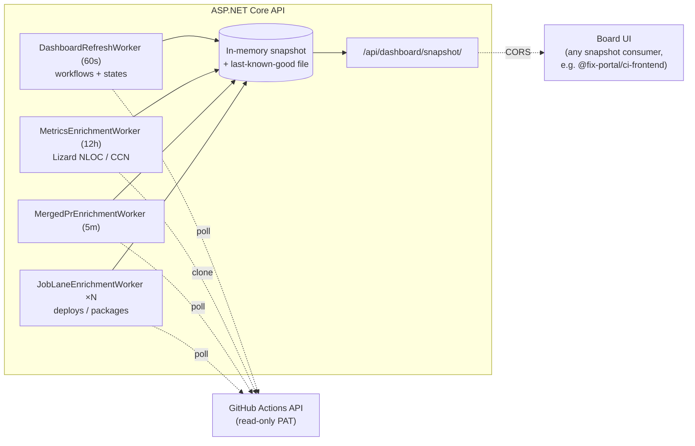

# FixPortal CI Dashboard — Backend API

> The backend for a read-only, **org-wide** CI/CD status board. Point it at a
> GitHub org and it auto-discovers every repository and workflow, polls the
> GitHub Actions API server-side, and exposes a single snapshot of build, deploy,
> package, PR, and code-metrics signals over `GET /api/dashboard/snapshot`. Any
> client can render that snapshot; the open-source
> [`@fix-portal/ci-frontend`](https://github.com/FixPortal/fixportal-ci-frontend)
> board is one such UI. This service is a pure ASP.NET Core API with no
> database — all calls are server-side with a read-only PAT.

## What it does

Give it a `GitHub:Owner` and a read-only token, and it surfaces — for **every**
non-archived repo in that org, with no per-repo configuration:

- **Workflow status** — latest run state per workflow (success / failure /
  running / no-CI), with deep links out to the run.
- **Job lanes** — named lanes (e.g. *Deploys*, *Packages*) that break out
  matching workflow **jobs** as their own status chips, configurable by name
  pattern.
- **Open PRs** and the org's **most-recently-merged PR**.
- **Code metrics** — NLOC and cyclomatic complexity per repo via
  [Lizard](https://github.com/terryyin/lizard), refreshed on a slow cadence.
- **A "No CI" treatment** for repos with no workflows, plus a hide toggle.

It is deliberately **read-only**: the token grants only *Read* permissions, the
token never reaches the browser, and the board keeps the last-known-good snapshot
if a refresh fails rather than blanking.

## Architecture

A single deployable ASP.NET Core API. Background hosted services enrich an
in-memory snapshot on independent cadences; the HTTP endpoint just hands out the
latest snapshot. Non-API routes 301-redirect to the canonical board at
`www.fixportal.org/ci`, where the board UI (any snapshot consumer, e.g. the
open-source `@fix-portal/ci-frontend`) fetches this API cross-origin.



| Layer | Tech |
|---|---|
| API | .NET 10, ASP.NET Core **minimal API**, NodaTime, OpenAPI + Scalar (dev only) |
| Metrics | Lizard (`1.22.2`), run against shallow clones |
| Host | Azure Container Apps (single always-on replica) |
| CI | GitHub Actions — .NET build/test, scheduled Stryker mutation testing, CodeQL, Dependabot |

## Compatibility

| Runtime | Support |
|---|---|
| .NET 10 | Required — no down-level targets |
| Docker (any OCI host) | Supported via multi-stage `Dockerfile` (non-root, port 8080) |
| Azure Container Apps | Primary deployment target |

## Quick start — Docker Compose (full stack)

The easiest way to run a complete dashboard instance. Requires **Docker** and a
GitHub fine-grained PAT (see [operator-handoff.md](operator-handoff.md#github)
for exact scopes).

```
cp .env.example .env
# Edit .env: set GITHUB_TOKEN and GITHUB_OWNER
docker compose up
```

Both steps are required — the backend fails fast on startup if `GITHUB_TOKEN` or
`GITHUB_OWNER` is unset, with `GitHub:Owner must be configured (e.g. set
GitHub__Owner).` Compose auto-loads `.env` from the project directory; exported
environment variables work equally well.

Open `http://localhost:8082` for the board. The backend snapshot API is at
`http://localhost:5049/api/dashboard/snapshot`. Both ports are published on
`127.0.0.1` only — the snapshot endpoint is unauthenticated, so it is not offered
to the LAN.

The `frontend` service uses the board UI image published from
[fixportal-ci-frontend](https://github.com/FixPortal/fixportal-ci-frontend).
Both images are on GHCR and updated on every push to `main`.

## Quick start (API only / development)

Prerequisites: **.NET 10 SDK** and a fine-grained GitHub PAT (see
[operator-handoff.md](operator-handoff.md#github) for exact scopes — read-only
**Actions** at minimum; add **Pull requests** and **Contents** for PR and metrics
data).

```
# 1. Configure the token (user secrets keep it out of source)
cd src/FixPortal.Ci.Backend.Api
dotnet user-secrets init
dotnet user-secrets set "GitHub:Token" "<your-read-only-PAT>"
dotnet user-secrets set "GitHub:Owner" "<your-org>"

# 2. Run the API (http profile listens on http://localhost:5049)
dotnet run
```

The snapshot is then at `http://localhost:5049/api/dashboard/snapshot`; any
non-API path redirects to `https://www.fixportal.org/ci`. To run a board UI
against a local API, see [fixportal-ci-frontend](https://github.com/FixPortal/fixportal-ci-frontend).

## Configuration

All settings live in `src/FixPortal.Ci.Backend.Api/appsettings.json` under
`GitHub` and `Dashboard`. The one most forks change is `GitHub:Owner`. Any value
can be overridden by an environment variable using `__` for `:` (e.g.
`GitHub__Token`). The full table — owner, token, refresh cadences, archived/
reusable/CodeQL filters, metrics, merged-PR tracking, and job lanes — is
documented in **[operator-handoff.md](operator-handoff.md#configuration-model)**.

### Review signals (`ReviewSignals`)

A top-level `ReviewSignals` section (a sibling of `Dashboard`, not nested under
it) adds a per-reviewer status pill — e.g. a CodeRabbit or Gitar pass, a CodeQL
scan — to each open pull request in the snapshot. It ships **off in effect**:
`ReviewSignals:Reviewers` is an empty array by default, and with no reviewers
configured the enrichment worker issues zero GitHub requests. Set the real
values in deployment configuration, not `appsettings.json`, the same way as
`GitHub:Token`.

| Setting | Default | What it does |
|---|---|---|
| `ReviewSignals:Enabled` | `true` | Master switch. Even when `true`, the worker stays idle until `Reviewers` is non-empty. |
| `ReviewSignals:RefreshSeconds` | `150` | Enrichment cadence, independent of `Dashboard:RefreshSeconds` — the pills refresh on their own schedule, not the 20 s board loop. The last-known-good cache expires after 3× this interval, so a persistently failing fetch drops to no pills rather than showing a stale pass. |
| `ReviewSignals:ExcludedAuthors` | `dependabot[bot]`, `renovate[bot]` | Pull-request authors (matched case-insensitively) whose PRs carry no review signals at all. |
| `ReviewSignals:Reviewers` | *(empty)* | The reviewers to report — see below. |

Each entry in `Reviewers` is:

| Field | Meaning |
|---|---|
| `Name` | Display label on the pill, e.g. `"CodeRabbit"`. |
| `BotLogin` | The reviewing bot's GitHub login. Required when `Source` is `ReviewThreads`; matched against unresolved review-thread authors and PR participants. |
| `RequiredLabel` | When set, this reviewer only applies to pull requests carrying that label — how CodeRabbit is scoped to HIGH-tier PRs only. Absent means every pull request. |
| `Source` | `ReviewThreads` (default) reads unresolved review-thread authorship; `CodeScanning` reads open code-scanning alert counts on the PR's head ref instead (used for CodeQL) and ignores `BotLogin`. |

FixPortal's worked example, set via deployment configuration:

```json
"ReviewSignals": {
  "Enabled": true,
  "RefreshSeconds": 150,
  "ExcludedAuthors": [ "dependabot[bot]", "renovate[bot]" ],
  "Reviewers": [
    { "Name": "CodeRabbit", "BotLogin": "coderabbitai", "RequiredLabel": "review-high" },
    { "Name": "Gitar", "BotLogin": "gitar-app" },
    { "Name": "CodeQL", "Source": "CodeScanning" }
  ]
}
```

Each reviewer resolves to one of **four** pill states, not three:

| State | Meaning |
|---|---|
| `clean` | The reviewer demonstrably ran against the pull request's **current head commit** and left nothing outstanding. A review of an earlier commit does not keep a PR clean after a later push — participation is re-checked against the head commit on every sweep. |
| `outstanding` | The reviewer has open items — unresolved review threads or open code-scanning alerts — `count` on the pill says how many. |
| `pending` | Required here, but there is no evidence it has run yet. **Not a pass** — a paused or rate-limited reviewer lands here, indistinguishable from one that simply has not started. |
| `disabled` | Not required on this pull request, e.g. `RequiredLabel` is set and the PR lacks that label. |

A `CodeScanning` reviewer needs the **Code scanning alerts: read** PAT
permission — see [operator-handoff.md](operator-handoff.md#github).

## Deployment

CI deploys to **Azure Container Apps** on every push to `main`. The publish job
builds the image once on Blacksmith, pushes `sha-<full commit SHA>` to GHCR, and
the deploy job imports that exact image into ACR before
`deploy/bicep/main.bicep` ships it. The Bicep template
and workflow carry **no** subscription, registry, or resource identifiers — those
come from GitHub Actions **repository Secrets** (kept as secrets so they are
masked in the public Actions logs), so the template is reusable as-is. One-time
bootstrap (OIDC, secrets), the full secret/variable list, and the custom-domain
dance are all in **[operator-handoff.md](operator-handoff.md#deploying-to-azure)**.

To host elsewhere, the `Dockerfile` is a standard multi-stage build (non-root,
port 8080) that runs on any container platform — only the GitHub token and owner
are required.

## Testing

```
dotnet tool restore
dotnet csharpier check .
dotnet build FixPortal.Ci.Backend.slnx --configuration Release
dotnet test FixPortal.Ci.Backend.slnx --configuration Release --no-build
```

## Troubleshooting

| Symptom | Cause | Fix |
|---|---|---|
| Backend container exits at startup with `OptionsValidationException: GitHub:Owner must be configured` (frontend stays up) | `GITHUB_TOKEN` / `GITHUB_OWNER` not set — no `.env` in the project directory and nothing exported | `cp .env.example .env` and fill both in, then `docker compose up -d` |
| Snapshot returns stale data after a workflow run | Refresh worker polls on a 60 s cadence; run completed between polls | Wait up to 60 s, or restart to force an immediate poll |
| Snapshot endpoint returns `204 No Content` | No snapshot yet — the first poll has not completed, or every poll has failed | Allow ~5 s after startup; if it persists, check the container logs for `GitHubAuthException` |
| `MetricsEnrichmentWorker` logs `git clone` errors | PAT lacks **Contents** read permission | Re-issue PAT with Contents (read) and update `GitHub__Token` |
| PRs not appearing | PAT lacks **Pull requests** read permission | Re-issue PAT with Pull requests (read) and update `GitHub__Token` |
| CORS errors in the browser | Board UI origin not in `AllowedOrigins` | Add origin to `Dashboard:AllowedOrigins` in `appsettings.json` or via `Dashboard__AllowedOrigins__0` env var |
| `401 Unauthorized` from GitHub API | Token expired, revoked, or the value is not a GitHub PAT (fine-grained tokens start `github_pat_`, classic ones `ghp_`) | Generate a new fine-grained PAT and update the secret or env var |

## Contributing

PRs welcome. Branch from `main`; CI runs formatting, build, xUnit tests, and
CodeQL on every PR. Stryker runs nightly and on manual dispatch.

```
dotnet tool restore
dotnet csharpier format .
dotnet build FixPortal.Ci.Backend.slnx --configuration Release
dotnet test FixPortal.Ci.Backend.slnx --configuration Release --no-build
```

Merge style is **rebase-merge** — squash and merge commits are not used.

## License

[Apache-2.0](LICENSE) © 2026 Chris Dowling.

## Appendix

### Container images

The backend image publishes to GHCR on every push to `main`, tagged `:latest`
and `:sha-<full commit SHA>`.

| Image | Pull command |
|---|---|
| Backend API | `docker pull ghcr.io/fixportal/fixportal-ci-backend:latest` |
| Board UI | `docker pull ghcr.io/fixportal/fixportal-ci-frontend:latest` |

### Related repositories

| Repository | Purpose |
|---|---|
| [`FixPortal/fixportal-ci-frontend`](https://github.com/FixPortal/fixportal-ci-frontend) | Open-source board UI — reference snapshot consumer |

### Key endpoints

| Endpoint | Description |
|---|---|
| `GET /api/dashboard/snapshot` | Full org snapshot — workflows, PRs, metrics, job lanes |
| `GET /*` (non-API) | 301 redirect to `https://www.fixportal.org/ci` |
