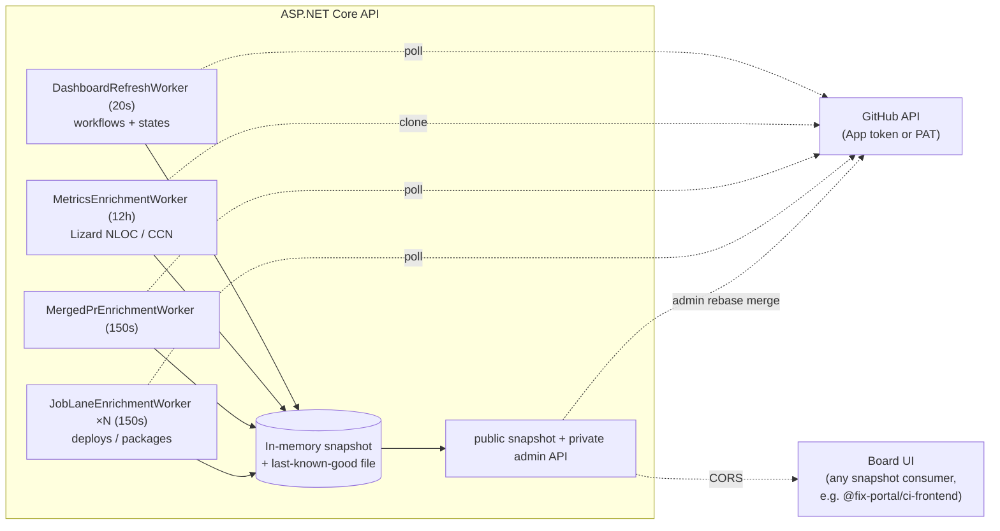

# FixPortal CI Dashboard — Backend API

> The backend for an **org-wide** CI/CD status board. Point it at a
> GitHub org and it auto-discovers repositories and workflows, optionally narrows
> the sweep by repository-name or GitHub-topic filters, polls the GitHub Actions
> API server-side, and exposes a single snapshot of build, deploy, package, PR,
> and code-metrics signals over `GET /api/dashboard/snapshot`. Any client can
> render that snapshot; the open-source
> [`@fix-portal/ci-frontend`](https://github.com/FixPortal/fixportal-ci-frontend)
> board is one such UI. This service is a pure ASP.NET Core API with no
> database — all GitHub calls are server-side.

## What it does

Give it a `GitHub:Owner` and a token, and by default it surfaces — for
**every** non-archived repo in that org, with no per-repo configuration:

- **Workflow status** — latest run state per workflow (success / failure /
  running / no-CI), with deep links out to the run.
- **Job lanes** — named lanes (e.g. *Deploys*, *Packages*) that break out
  matching workflow **jobs** as their own status chips, configurable by name
  pattern.
- **Open PRs** and the org's **most-recently-merged PR**.
- **Code metrics** — NLOC and cyclomatic complexity per repo via
  [Lizard](https://github.com/terryyin/lizard), refreshed on a slow cadence.
- **A "No CI" treatment** for repos with no workflows, plus a hide toggle.

Polling remains read-only. The sole mutation is the admin-key-protected
`POST /api/dashboard/merge`, which performs a rebase merge for a repository in
the current dashboard snapshot. The token never reaches the browser, and the
board keeps the last-known-good snapshot if a refresh fails rather than blanking.

## Architecture

A single deployable ASP.NET Core API. Background hosted services enrich an
in-memory snapshot on independent cadences; the HTTP endpoint just hands out the
latest snapshot. Non-API routes 301-redirect to the canonical board at
`www.fixportal.org/ci`, where the board UI (any snapshot consumer, e.g. the
open-source `@fix-portal/ci-frontend`) fetches this API cross-origin.



| Layer | Tech |
|---|---|
| API | .NET 10, ASP.NET Core **minimal API**, NodaTime, OpenAPI + Scalar (dev only) |
| Metrics | Lizard (`1.22.2`), run against shallow clones |
| Host | Azure Container Apps (single always-on replica) |
| CI | GitHub Actions — .NET build/test, scheduled Stryker mutation testing, CodeQL, Dependabot |

## Compatibility

| Runtime | Support |
|---|---|
| .NET 10 | Required — no down-level targets |
| Docker (any OCI host) | Supported via multi-stage `Dockerfile` (non-root, port 8080) |
| Azure Container Apps | Primary deployment target |

## Quick start — Docker Compose (full stack)

The easiest way to run a complete dashboard instance. Requires **Docker** and a
GitHub fine-grained PAT (see [operator-handoff.md](operator-handoff.md#github)
for exact scopes).

```
cp .env.example .env
# Edit .env: set GITHUB_TOKEN and GITHUB_OWNER
docker compose up
```

Both steps are required — the backend fails fast on startup if `GITHUB_TOKEN` or
`GITHUB_OWNER` is unset, with `GitHub:Owner must be configured (e.g. set
GitHub__Owner).` Compose auto-loads `.env` from the project directory; exported
environment variables work equally well.

Open `http://localhost:8082` for the board. The backend snapshot API is at
`http://localhost:5049/api/dashboard/snapshot`. Both ports are published on
`127.0.0.1` only — the snapshot endpoint is unauthenticated, so it is not offered
to the LAN.

The `frontend` service uses the board UI image published from
[fixportal-ci-frontend](https://github.com/FixPortal/fixportal-ci-frontend).
Both images are on GHCR and updated on every push to `main`.

## Quick start (API only / development)

Prerequisites: **.NET 10 SDK** and a fine-grained GitHub PAT (see
[operator-handoff.md](operator-handoff.md#github) for exact scopes — read-only
permissions are enough for polling; merging requires **Contents: Read and write**).

```
# 1. Configure the token (user secrets keep it out of source)
cd src/FixPortal.Ci.Backend.Api
dotnet user-secrets init
dotnet user-secrets set "GitHub:Token" "<your-GitHub-PAT>"
dotnet user-secrets set "GitHub:Owner" "<your-org>"

# 2. Run the API (http profile listens on http://localhost:5049)
dotnet run
```

The snapshot is then at `http://localhost:5049/api/dashboard/snapshot`; any
non-API path redirects to `https://www.fixportal.org/ci`. To run a board UI
against a local API, see [fixportal-ci-frontend](https://github.com/FixPortal/fixportal-ci-frontend).

## Configuration

Settings are bound from configuration. `src/FixPortal.Ci.Backend.Api/appsettings.json`
supplies the `GitHub`, `Dashboard`, and `ReviewSignals` defaults; `MergeState`,
`Admin`, `IdeIntegration`, and `Cors` use code defaults unless host configuration
sets them. The one most forks change is
`GitHub:Owner`. Any value can be overridden by an environment variable using
`__` for `:` (e.g. `GitHub__Token`). The full table — owner, token, refresh cadences, archived/
reusable/CodeQL filters, metrics, merged-PR tracking, and job lanes — is
documented in **[operator-handoff.md](operator-handoff.md#configuration-model)**.

### Authentication (`GitHub`, `GitHubApp`)

The dashboard authenticates **outbound** to GitHub in one of two modes. There is no
inbound GitHub auth: the App subscribes to no webhook events and is polling credentials
only.

| Mode | Selected when | Credential |
|---|---|---|
| GitHub App *(recommended)* | `GitHubApp:AppId` **and** `GitHubApp:PrivateKeyPem` are both non-blank | Installation token, minted per hour |
| Personal access token | either App setting is missing | `GitHub:Token` |

The App wins whenever both of its settings are present, and `GitHub:Token` is then
ignored entirely.

| Setting | Required | Notes |
|---|---|---|
| `GitHubApp__AppId` | for App mode | Numeric App ID |
| `GitHubApp__PrivateKeyPem` | for App mode | PEM contents, not a path |
| `GitHubApp__InstallationId` | no | Discovered once via `GET /orgs/{owner}/installation` when unset, so a reinstall needs no configuration change |
| `GitHub__Token` | for PAT mode | Ignored in App mode |

**A fine-grained PAT degrades every review pill, not only the check-run ones.** A PAT
cannot read check runs at all: `statusCheckRollup` answers *"Resource not accessible by
personal access token"* per node, and the PAT UI offers no "Checks" permission to grant.
That field shares one GraphQL document with `reviews`, `reviewThreads` and `comments`
(`Integrations/GitHub/GitHubOrgClient.cs`), and the client treats any `errors` array as a
failed call — so the whole repository's signals fall back to last-known-good, including
the Secret Scanning pill, which is fetched over REST. Treat PAT mode as degraded, not as
missing one source.

The second reason is budget: the GraphQL points allowance is metered **per user**, so a
PAT-authenticated dashboard competes with whoever is running `gh` at a terminal. An
installation gets its own. Both reasons are recorded in full on `GitHubAppOptions`.

### Repository selection (`Dashboard`)

Repository filters are optional and empty by default. Name and topic includes are
separate gates: when both are configured, a repository must match both. A match in
either exclude list always wins. Patterns are case-insensitive and support `*` and
`?` (not `**`, brace expansion, or negation).

| Setting | Environment variable form | Meaning |
|---|---|---|
| `Dashboard:IncludeRepositories` | `Dashboard__IncludeRepositories__0` | Include repository names matching any configured glob. |
| `Dashboard:ExcludeRepositories` | `Dashboard__ExcludeRepositories__0` | Exclude repository names matching any configured glob. |
| `Dashboard:IncludeTopics` | `Dashboard__IncludeTopics__0` | Include repositories with at least one topic matching any configured pattern. |
| `Dashboard:ExcludeTopics` | `Dashboard__ExcludeTopics__0` | Exclude repositories with at least one topic matching any configured pattern. |

For example, this examines production API repositories while omitting internal ones:

```json
"Dashboard": {
  "IncludeRepositories": [ "api-*" ],
  "IncludeTopics": [ "production" ],
  "ExcludeTopics": [ "internal" ]
}
```

The equivalent environment variables are
`Dashboard__IncludeRepositories__0=api-*`,
`Dashboard__IncludeTopics__0=production`, and
`Dashboard__ExcludeTopics__0=internal`. Add `__1`, `__2`, and so on for more
patterns. Blank entries are rejected at startup.

### Review signals (`ReviewSignals`)

A top-level `ReviewSignals` section (a sibling of `Dashboard`, not nested under
it) adds a per-reviewer status pill — e.g. a CodeRabbit or Gitar pass, a CodeQL
scan — to each open pull request in the snapshot. It ships **off in effect**:
`ReviewSignals:Reviewers` is an empty array by default, and with no reviewers
configured the enrichment worker issues zero GitHub requests. Set the real
values in deployment configuration, not `appsettings.json`, the same way as
`GitHub:Token`.

| Setting | Default | What it does |
|---|---|---|
| `ReviewSignals:Enabled` | `true` | Master switch. Even when `true`, the worker stays idle until `Reviewers` is non-empty. |
| `ReviewSignals:RefreshSeconds` | `150` | Enrichment cadence, independent of `Dashboard:RefreshSeconds` — the pills refresh on their own schedule, not the 20 s board loop. The last-known-good cache expires after 3× this interval, so a persistently failing fetch drops to no pills rather than showing a stale pass. |
| `ReviewSignals:ExcludedAuthors` | `dependabot`, `dependabot[bot]`, `renovate`, `renovate[bot]` | Pull-request authors (matched case-insensitively) whose PRs carry no review signals at all. Both spellings of each bot ship by default: GraphQL reports a Bot node's login **without** the `[bot]` suffix, which is a REST-ism, so a suffix-only list would never match. |
| `ReviewSignals:Reviewers` | *(empty)* | The reviewers to report — see below. |

Each entry in `Reviewers` is:

| Field | Meaning |
|---|---|
| `Name` | Display label on the pill, e.g. `"CodeRabbit"`. |
| `BotLogin` | The reviewing bot's GitHub login. Required when `Source` is `ReviewThreads`; matched against unresolved review-thread authors and PR participants. |
| `RequiredLabel` | When set, this reviewer only applies to pull requests carrying that label — how CodeRabbit is scoped to HIGH-tier PRs only. Absent means every pull request. |
| `Source` | `ReviewThreads` (default) reads unresolved review-thread authorship; `CodeScanning` reads open code-scanning alert counts on the PR's head ref instead (used for CodeQL) and ignores `BotLogin`; `SecretScanning` reads the repository's open secret-scanning alert count and likewise ignores `BotLogin`. |
| `PublicOnly` | When `true`, the reviewer is omitted entirely on private repositories — no pill, and nothing for the ready-to-merge verdict to wait on. For GitHub's scanning products, which are paid on private repos and free on public ones. |

FixPortal's worked example, set via deployment configuration:

```json
"ReviewSignals": {
  "Enabled": true,
  "RefreshSeconds": 150,
  "ExcludedAuthors": [ "dependabot", "dependabot[bot]", "renovate", "renovate[bot]" ],
  "Reviewers": [
    { "Name": "CodeRabbit", "BotLogin": "coderabbitai", "RequiredLabel": "review-high" },
    { "Name": "Gitar", "BotLogin": "gitar-bot", "CommentsCountAsParticipation": true },
    { "Name": "CodeQL", "Source": "CodeScanning", "PublicOnly": true },
    { "Name": "Secret Scanning", "Source": "SecretScanning", "PublicOnly": true }
  ]
}
```

The last two carry `PublicOnly` because GitHub's scanning products are paid on
private repositories and were switched off org-wide on 2026-08-04. Their
endpoints answer 403/404 on a private repo, which this worker reads as
`Pending` — a state such a repo can never leave, so every private pull request
was pinned to "not ready" and the board's Ready-to-merge pill disappeared
estate-wide. `SecretScanning` is repository-scoped rather than PR-scoped: the
alerts route takes no ref filter, so one open alert reports on every open pull
request in that repository.

**Code Quality is the awkward one, and its two halves come from different
places.** Both observed on `fixportal-ci-backend` PR #85 (2026-08-12). Note that
the product itself has since been disabled estate-wide — see *GitHub Code Quality
is disabled here* below — so what follows describes how the reviewer behaved
while it ran, and explains a configuration entry that currently has no live
input:

- Its **findings are review threads** authored by `github-code-quality` — two on
  that pull request — and are *not* alerts: `code-scanning/alerts` returned `0`
  open at the same moment. The CodeQL reviewer therefore does not cover it, and
  the two entries are not redundant.
- It is nonetheless **delivered by the code-scanning pipeline**: its workflow run
  is named "Code Quality: PR #85" but its path is
  `dynamic/github-code-scanning/codeql`. And it says *nothing at all* when it
  finds nothing — no review, no thread, no comment.

That combination is why it needs `CodeScanningCheckCountsAsParticipation`. On a
clean pull request there is no authored evidence it ran, so without that flag it
is indistinguishable from a reviewer that never ran and holds `Pending` forever —
blocking the ready-to-merge verdict on exactly the pull requests that are ready.
The flag says "the scan ran", never "the scan was happy": unresolved threads are
still decided first, so a green check cannot mask an open finding.

`CommentsCountAsParticipation` exists for Gitar, which reports findings as review
threads but announces a clean result as a plain issue comment — without the flag
it holds `Pending` on exactly the pull requests that are ready to merge. The
comment's presence is the whole signal; its content is never inspected.

Each reviewer resolves to one of **four** pill states, not three:

| State | Meaning |
|---|---|
| `clean` | The reviewer demonstrably ran against the pull request's **current head commit** and left nothing outstanding. A review of an earlier commit does not keep a PR clean after a later push — participation is re-checked against the head commit on every sweep. |
| `outstanding` | The reviewer has open items — unresolved review threads or open code-scanning alerts — `count` on the pill says how many. |
| `pending` | Required here, but there is no evidence it has run yet. **Not a pass** — a paused or rate-limited reviewer lands here, indistinguishable from one that simply has not started. |
| `disabled` | Not required on this pull request, e.g. `RequiredLabel` is set and the PR lacks that label. |

Reviewer sources need read access to what they read. In **App mode** that is
`security_events` for a `CodeScanning` reviewer and the separate
`secret_scanning_alerts` for a `SecretScanning` one; in **PAT mode** it is the
**Code scanning alerts: read** permission, with the degradation described under
[Authentication](#authentication-github-githubapp) applying to every pill. See
[operator-handoff.md](operator-handoff.md#github).

> `security_events` does **not** cover secret scanning. Without
> `secret_scanning_alerts`, GitHub answers that route **404, not 403**, so the count
> reads as "no such repository" rather than "not permitted", the alert count comes back
> null, and the pill sits at `pending` with nothing in the logs.

## Deployment

CI deploys to **Azure Container Apps** on every push to `main`. The publish job
builds the image once on a GitHub-hosted `ubuntu-latest` runner, pushes
`sha-<full commit SHA>` to GHCR, and
the deploy job imports that exact image into ACR before
`deploy/bicep/main.bicep` ships it. The Bicep template
and workflow carry **no** subscription, registry, or resource identifiers — those
come from GitHub Actions **repository Secrets** (kept as secrets so they are
masked in the public Actions logs), so the template is reusable as-is. One-time
bootstrap (OIDC, secrets), the full secret/variable list, and the custom-domain
dance are all in **[operator-handoff.md](operator-handoff.md#deploying-to-azure)**.

The deploy also requires the `CI_IDE_API_KEY` repository secret, with no leading
or trailing whitespace. It becomes the `ci-ide-api-key` Container Apps secret and
backs `IdeIntegration__ApiKey` for the authenticated `/api/ide/v1` API.

To host elsewhere, the `Dockerfile` is a standard multi-stage build (non-root,
port 8080) that runs on any container platform. The build uses public NuGet
dependencies and needs no registry credentials:

```shell
docker build -t fixportal-ci-backend .
```

At runtime only the GitHub token and owner are required.

## Testing

```
dotnet tool restore
dotnet csharpier check .
dotnet build FixPortal.Ci.Backend.slnx --configuration Release
dotnet test --solution FixPortal.Ci.Backend.slnx --configuration Release --no-build
```

## Troubleshooting

| Symptom | Cause | Fix |
|---|---|---|
| Backend container exits at startup with `OptionsValidationException: GitHub:Owner must be configured` (frontend stays up) | Under Compose, `GitHub__Owner: ${GITHUB_OWNER}` substitutes **empty** when the variable is unset, overriding the `FixPortal` default that ships in `appsettings.json` — so no `.env` in the project directory and nothing exported means no owner. Same for the mode's credential | `cp .env.example .env`, then fill in `GITHUB_OWNER` plus either `GITHUB_TOKEN` (PAT mode) or the `GITHUBAPP__*` settings (App mode), and `docker compose up -d` |
| Snapshot returns stale data after a workflow run | Refresh worker polls on a 20 s cadence; run completed between polls | Wait up to 20 s, or restart to force an immediate poll |
| Snapshot endpoint returns `204 No Content` | No snapshot yet — the first poll has not completed, or every poll has failed | Allow ~5 s after startup; if it persists, check the container logs for `GitHubAuthException` |
| `MetricsEnrichmentWorker` logs `git clone` errors | Credential lacks **Contents** read | App mode: grant `contents` and accept the request on the installation. PAT mode: re-issue with Contents (read) and update `GitHub__Token` — which is **ignored** in App mode, so check which mode is live first |
| Merge endpoint returns `502` with a GitHub authorization failure | Credential lacks **Contents: Read and write** | App mode: grant `contents: write`, save, and accept the request on the organization installation. PAT mode: re-issue with Contents (read and write). Restart the backend revision to replace a cached installation token immediately |
| PRs not appearing | Credential lacks **Pull requests** read | App mode: grant `pull_requests`. PAT mode: re-issue with Pull requests (read) and update `GitHub__Token` |
| Secret Scanning pill stuck at `pending`, nothing in the logs | The installation has `security_events` but not `secret_scanning_alerts`. GitHub answers that route **404, not 403**, so the count returns null and the "unreadable" warning never fires | Grant `secret_scanning_alerts` on the App, then **accept the request on the installation** — widening the App alone does nothing. `gh api apps/<slug> -q .permissions` and `gh api orgs/<owner>/installations` read different things; a moved installation `updated_at` is the proof it took. Installation tokens are cached up to an hour, so restart the active revision to pick it up now |
| Review pills degraded or absent across every repository | Running in PAT mode: a PAT cannot read check runs, and that failure takes the whole GraphQL document with it | Move to App mode — see [Authentication](#authentication-github-githubapp) |
| CORS errors in the browser | Board UI origin not in `Cors:AllowedOrigins` | Add origin via `Cors__AllowedOrigins__0` (or the equivalent `Cors:AllowedOrigins` configuration key) |
| `401 Unauthorized` from GitHub API | **PAT mode**: token expired, revoked, or not a GitHub PAT (fine-grained start `github_pat_`, classic `ghp_`). **App mode**: the private key no longer matches the App, or the App was uninstalled | PAT mode: generate a new fine-grained PAT and update the secret or env var. App mode: re-issue `GitHubApp__PrivateKeyPem` from the App's settings page and confirm the installation still exists — `GitHub__Token` is ignored here and changing it will not help |

## Contributing

PRs welcome. Branch from `main`; CI runs actionlint, formatting, build and xUnit
tests on every PR, and CodeQL runs through GitHub's default setup. Stryker runs
weekly (Saturdays, 02:45 UTC) and on manual dispatch.

### GitHub Code Quality is disabled here, like the rest of the estate

Current state: `not-configured`, `ai_findings_option: disabled`, as on all eight
public FixPortal repositories since 2026-08-12.

This section previously argued the opposite — that this repository was a
documented exception because Code Quality is free on public repositories, and
that only the paid private-repository products were switched off org-wide on
2026-08-04. **That premise was wrong.** Code Quality is a paid product
regardless of repository visibility, so it had been billing on all eight public
repositories. The 2026-08-12 GitHub estate audit found it enabled on every one
of them and it was disabled across the board.

The note is kept rather than deleted because it was the artefact a later audit
would have read to justify re-enabling it.

One real consequence survives the correction, and it is a **known gap, not a
resolved point**: the board's Code Quality review pill reads this product's
review threads, so with the product not-configured that pill has no source on
any public repository. It is intentionally omitted from the active example
above; `CodeScanningCheckCountsAsParticipation` documents how it behaved while
enabled and has no live input today.

Re-enabling Code Quality anywhere costs money and needs an explicit decision on
the current charges. Do not re-enable it on free-tier grounds.

```
dotnet tool restore
dotnet csharpier format .
dotnet build FixPortal.Ci.Backend.slnx --configuration Release
dotnet test --solution FixPortal.Ci.Backend.slnx --configuration Release --no-build
```

Merge style is **rebase-merge** — squash and merge commits are not used.

Notable changes are recorded in [CHANGELOG.md](CHANGELOG.md).

## License

[Apache-2.0](LICENSE) © 2026 Chris Dowling.

## Appendix

### Container images

The backend image publishes to GHCR on every push to `main`, tagged `:latest`
and `:sha-<full commit SHA>`.

| Image | Pull command |
|---|---|
| Backend API | `docker pull ghcr.io/fixportal/fixportal-ci-backend:latest` |
| Board UI | `docker pull ghcr.io/fixportal/fixportal-ci-frontend:latest` |

### Related repositories

| Repository | Purpose |
|---|---|
| [`FixPortal/fixportal-ci-frontend`](https://github.com/FixPortal/fixportal-ci-frontend) | Open-source board UI — reference snapshot consumer |

### Key endpoints

| Endpoint | Description |
|---|---|
| `GET /api/dashboard/snapshot` | Anonymous public projection: private repositories are removed server-side unless the security-sensitive `Admin:ExposePrivateToGuests=true` escape hatch is deliberately set. CORS applies; returns `204` before a snapshot exists. Use that escape hatch only on a private, trusted network. |
| `GET /api/dashboard/snapshot/admin` | Full private-inclusive snapshot. Requires `X-Admin-Key`; every response is `Cache-Control: private, no-store` and `Vary: X-Admin-Key`. |
| `GET /api/health` | Anonymous credential health: `200` healthy or `503` degraded, without exposing the underlying GitHub error. |
| `GET /api/ide/v1/snapshot` | Full IDE projection. Requires `X-CI-IDE-Key`; `Cache-Control: no-store`, `Vary: X-CI-IDE-Key`, and supports ETag conditional requests. |
| `GET /api/ide/v1/repositories/{repository}/runs/{runId}/diagnosis` | Failure diagnosis for an IDE snapshot run. Requires `X-CI-IDE-Key`; `Cache-Control: no-store` and `Vary: X-CI-IDE-Key`. |
| `GET /*` (non-API) | 301 redirect to `https://www.fixportal.org/ci` |
